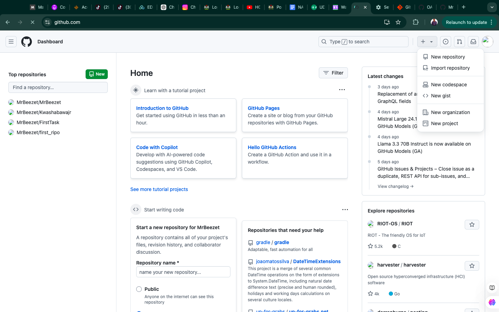
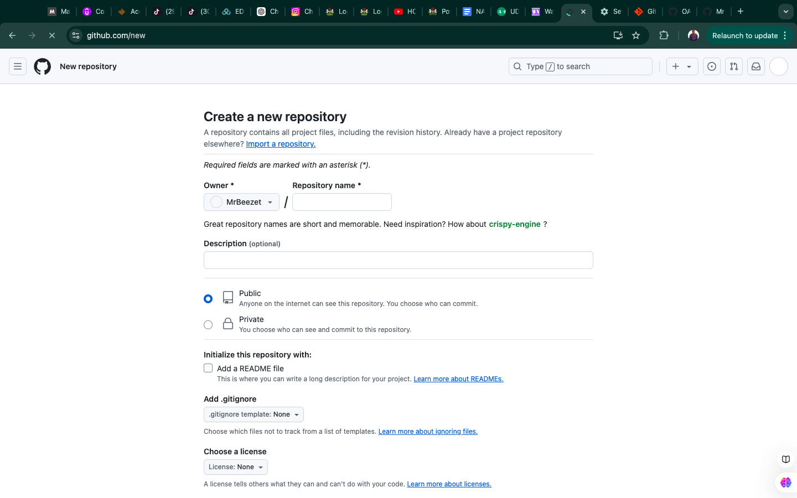
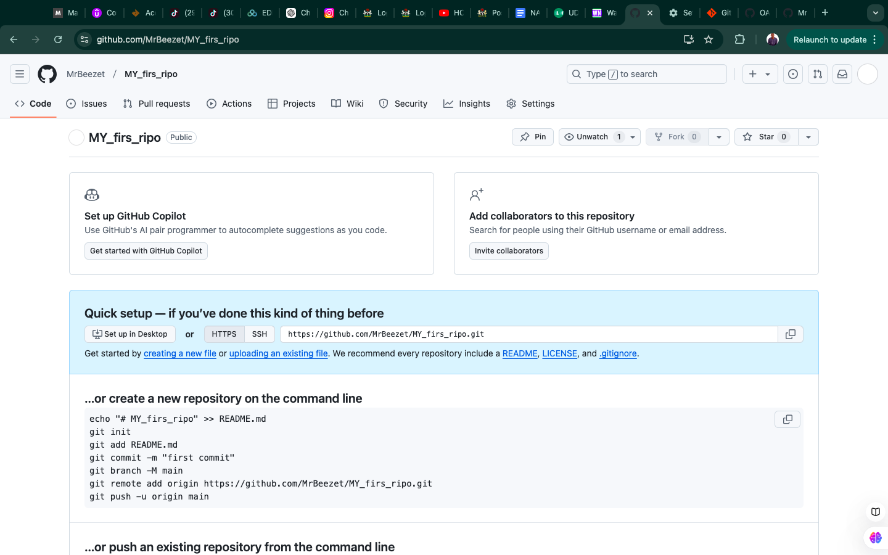

# How to create a git ripo via github and via cmd

# How to create Ripo from github

**Creating a Git Repository on GitHub
Log in to GitHub:**

- Go to GitHub and sign in to your account.

- Create a New Repository:

- Click the green "New" button or go to your repositories and click "New".

- Fill in the details:
Repository Name: Enter a name (e.g., my-project).

- Description (optional): Write a short description.
- Visibility: Choose Public or Private.
- *(Optional)* Check "Add a README file" if you want a README created automatically.
- Click Create Repository.

Once the repository is created, you’ll see instructions to either clone it or initialize it.

# How to create from command line interface
## Creating a Git Repository via Command Line
Install Git:

- **Ensure Git is installed**: Use git --version to check. If not, download Git.
- **Navigate to Your Project Folder:**

cd path/to/your/project

- **Initialize Git:**

**Run:**
git init
This creates a .git folder in your project directory.

**Add Files to the Repository:**
Add all files:    git add .
 
 Or add specific files:
*Cmd*
git add file_name

**Commit the Files:**

**Commit your changes with a message:**
git commit -m "Initial commit"

**Connect to a Remote Repository:**
If you created a repository on GitHub (e.g., my-project), copy the repository URL (e.g., https://github.com/username/my-project.git).

**Link it:**
git remote add origin https://github.com/username/my-project.git

**Push Changes:**

Push the local repository to GitHub:
git push -u origin main
If the default branch is master (older setup), 

**use:**
git push -u origin master.

